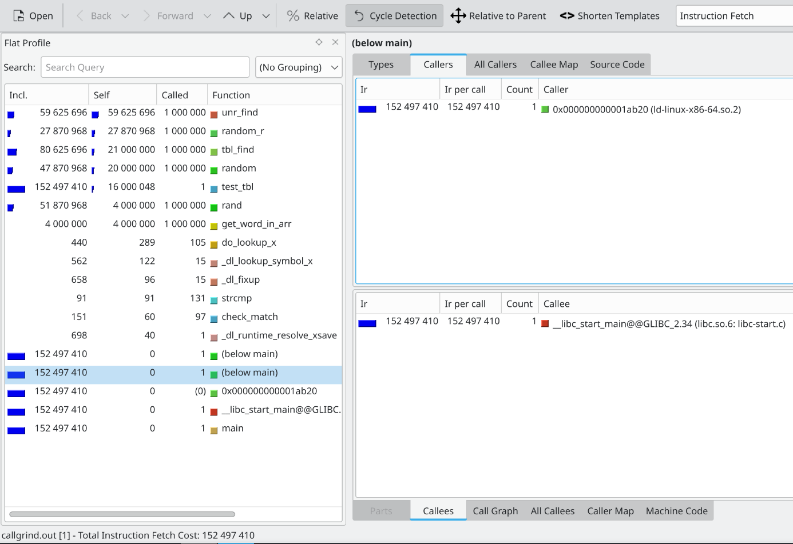
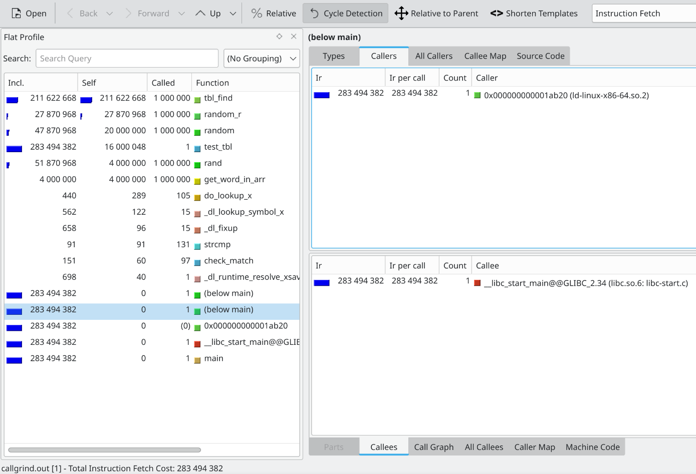

# Теоретическое введение

Хеш-таблица - структура данных, поддерживающая операции вставки, поиска, изменения и удаления за амортизированное константное время. Для этого используется хеш-функция, принимающая объект, который мы хотим хранить, и возвращающая целое число из ограниченного диапазона, называемое хешем. Это число используется в качестве индекса в массиве, в котором хранятся объекты. 

Так как количество возможных объектов больше диапазона значений хеш-функции, для некоторых объектов хеши будут совпадать. Такая ситуация называется коллизией. Существует множество методов решения коллизий, простейший из них - метод цепочек. В нём ячейки таблицы хранят списки, которые могут содержать несколько элементов.

Для хеш-таблиц вводится характеристика, называемая коэффициентом заполнения (англ. load factor), равная отношению количества добавленных объектов ко вместимости таблицы. Для метода цепочек его величина обычно больше 1. При слишком большом коэффициенте заполнения работа таблицы замедляется. Для метода цепочек оптимальное значение лежит в диапазоне от 1 до 3.

# Описание работы

В данной работе исследуются ассемблерные оптимизации хеш-таблицы с закрытой адресацией. Исследуемая хеш-таблица хранит строки. В неё вставляются все слова из первой части "Властилина колец" Толкина (9423 уникальных), затем измеряется производительность при 1 миллионе операций поиска. В качестве хеш-функции использовалась crc32. В учебных целях load factor хеш-таблицы был увеличен до 20.

Для измерений производительности используется профилировщик Valgrind с расширением Callgrind. Он измеряет количество тактов процессора, потраченное на выполнение каждой функции, а также общее количество тактов. После профилирования функции сортируются по убыванию количества тактов, и самые затратные подвергаются оптимизации. 

Valgrind - эмулирующий профилировщик, поэтому результаты его измерений неточные. Для получения более точных результатов также измеряется количество потраченных тиков процессора с помощью rdtsc. Проводится 256 тестов по 1 миллиону операций поиска, для них считается среднее значение и стандартное отклонение кол-ва тиков. Перед этими тестами проводится 128 тестов, результат которых игнорируется. Это делается для стабилизации частоты процессора.

# Стадии оптимизации

## Неоптимизированная версия

Изначальная версия без оптимизаций и без оптимизирующих флагов компилятора. Самой затратной функцией оказалась strcmp


## Компиляция с флагом O3

Применение оптимизаций компилятором помогло ускорить программу в 1.15 раз. Strcmp осталась на первом месте


## Развёртка списка

Развёртка списка (англ. list unrolling) - это оптимизация, при которой в одном узле хранятся несколько значений в последовательных участках памяти. В данной работе в одном узле хранятся 4 строки. Эта оптимизация улучшает использование кеша процессора и уменьшает кол-во переходов по указателям. Развёртка списка ускорила программу в 1.7 раз, при этом Valgrind зафиксировал увеличение кол-ва тактов в 1.029 раз. Скорее всего это произошло из-за низкого качества эмуляции Valgrind-ом.


## Оптимизация strcmp

Первой для оптимизации была выбрана функция сравнения строк ```strcmp```, так как она находилась вверху списка Valgrind-а по кол-ву тактов. Для оптимизации использовались intrinsic-функции, соответствующие ассемблерным инструкциям x86-64.

В нашей таблице эта функция используется только для проверки равенства строк. Длина каждого слова, хранящегося в таблице, не превосходит 31, поэтому их можно поместить в массивы длиной 32 и дополнить в конце нулями. В таком случае для проверки равенства строк достаточно посчитать xor двух массивов и сравнить результат с нулём. 

Массивы со строками выровнены по 32 байтам, поэтому используется функция ```_mm256_load_si256```, загружающая выровненный массив длиной 32 байта в ymm-регистр. Функция ```_mm256_xor_si256``` считает xor двух ymm-регистров, а ```_mm256_testz_si256``` проверяет регистр с результатом на равенство нулю. Оптимизация ```strcmp``` дала ускорение в 1.4 раза.

Код оптимизированной функции:
```
inline int mystrcmp(const char* lft, const char* rgt)
{
    __m256i xor_res = _mm256_xor_si256(_mm256_load_si256((const __m256i*)lft), _mm256_load_si256((const __m256i*)rgt));
    return !_mm256_testz_si256(xor_res, xor_res);
}
```

Результат профилирования после оптимизации:


## Оптимизация хеш-функции

После оптимизации strcmp наверху в Valgrind оказалась функция поиска в таблице. Большую часть её времени работы занимает вычисление хеша, при этом можно сделать вывод, что хеш-функция "заинлайнена" в ```tbl_find```, так как она отсутствует в выводе Valgrind в качестве отдельной функции. Таким образом, следующей оптимизации подверглась ```hash-fn```.

Оптимизация осуществлялась с помощью ассемблерных вставок. Использовалась инструкция ```crc32```, вычисляющая crc32-хеш 64-битового значения. Чтобы посчитать хеш 256-битового слова, она применялась 4 раза, при этом хеш предыдущей части строки передавался как один из аргументов. Оптимизация дала ускорение в 1.08 раза.

Код исходной функции:

```
int hash_fn(const char* s, unsigned mod)
{
    int h = -1;
    while (*s != '\0')
        h = (h >> 8) ^ crc32_table[(h ^ *s++) & 0xff];
    return (h ^ -1) % mod;
}
```

Код оптимизированной функции:
```
int my_hash_fn(const char* s, unsigned mod)
{
    long long hash, str;
    asm volatile(
        "movq $-1, %0\n"

        "mov (%1), %2\n"
        "crc32 %2, %0\n"
        "add $8, %1\n"

        "mov (%1), %2\n"
        "crc32 %2, %0\n"
        "add $8, %1\n"

        "mov (%1), %2\n"
        "crc32 %2, %0\n"
        "add $8, %1\n"

        "mov (%1), %2\n"
        "crc32 %2, %0\n"

        : "+r" (hash), "+r" (s), "=r" (str)
    );
    
    return hash % mod;
}
```

Результат профилирования после оптимизации:



## Оптимизация поиска в списке

После оптимизации хеш-функции на первом месте оказалась функция поиска в списке. Она была переписана на ассемблере в отдельном файле, который после компиляции линковался с основной программой. После этой оптимизации программа замедлилась на 4%, поэтому было решено её отбросить.

Код исходной функции:

```
int unr_find(UnrNode* node, char* s)
{
    while (node != NULL)
    {
        for (int i = 0; i < unroll_coeff; ++i)
            if (tbl_strcmp(node->s + i * maxlen, s) == 0) return 1;
        node = node->next;
    }
    return 0;
}
```

Код оптимизированной функции:

```
; -------------------------------------
; Args:
; rdi - node
; rsi - s
;
; Returns:
; eax - result
;
; Destroys:
; rcx
; -------------------------------------
my_unr_find:
    push rbx
    mov rbx, rdi
    jmp my_unr_find_cond

    my_unr_find_loop:
    xor rcx, rcx

    my_unr_find_inner_loop:
    mov rdi, rcx
    shl rdi, 5
    add rdi, QWORD [rbx]

    ; mystrcmp inlined
    vmovdqa ymm0, [rsi]
    vpxor   ymm0, ymm0, [rdi]
    xor     eax, eax
    vptest  ymm0, ymm0
    setne   al
    vzeroupper

    test rax, rax
    jne my_unr_find_continue

    mov eax, 1
    pop rbx
    ret

    my_unr_find_continue:
    inc rcx
    cmp rcx, 4
    jne my_unr_find_inner_loop

    mov rbx, QWORD [rbx + 8]
    my_unr_find_cond:
    test rbx, rbx
    jne my_unr_find_loop

    xor eax, eax
    pop rbx
    ret
```

Результат профилирования после оптимизации:



# Вывод

Было проведено 4 оптимизации программы. Из них одна заключалась в изменении структуры данных, а остальные 3 были ассемблерными. Были попробованы разные виды ассемблерных оптимизаций: intrinsic-функции, ассемблерные вставки, линковка отдельного файла.

Таблица с результатами измерения производительности всех версий:

| Версия                      | Кол-во тиков (*1e9) | Опт. отн. предыд. | Опт. отн. O3   | Опт. отн. развёртки  |
| -----------                 | ------------------- | ----------------- | -------------- | -------------------- |
| неоптимизированная          | 6.328 +- 0.081      | -                 | -              | -                    |
| компил. с O3                | 5.524 +- 0.047      | 1.146 +- 0.024    | 1.000          | -                    |
| развёртка списка            | 3.323 +- 0.024      | 1.662 +- 0.026    | 1.662 +- 0.026 | 1.000                |
| оптимизация strcmp          | 2.394 +- 0.046      | 1.388 +- 0.037    | 2.307 +- 0.064 | 1.158 +- 0.016       |
| оптимизация хеш-функции     | 2.219 +- 0.047      | 1.079 +- 0.044    | 2.489 +- 0.074 | 1.498 +- 0.043       |
| оптимизация поиска в списке | 2.309 +- 0.040      | 0.961 +- 0.037    | 2.392 +- 0.062 | 1.439 +- 0.035       |

Итоговая версия программы оказалась быстрее исходной в 2.5 раза. Ассемблерные оптимизации дали ускорение в 1.5 раза (относительно версии с развёрнутым списком).
